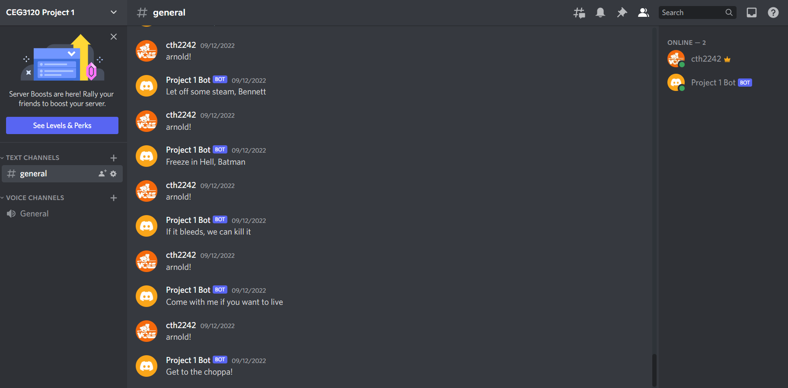

# Project 1

## Setup

### Dependencies

I had to install two dependencies:

- Discord.py
    - I used version 2.0.1
    - ` pip install -U discord.py`
- Dotenv
    - I used version 0.21.0
    - `pip install -U python-dotenv`

### How to Find the API Token

After creating your bot in the Discord Developer Portal, you can find the bot's API Token by clicking on the Bot link on the left hand side. Under the bot's username field you will see a heading called Token. Click the copy button under the heading to copy the bot's API token to your clipboard.

### Where To Put The API Token

The bot's API token should be kept a secret. This means that the bot's token should not be put into the source code. The best way to keep the token a secret is to insert it into an .env file on the machine that will be running the bot. The dotenv library will load the environment variables into your shell's environment variable so that they can be used in the code.  You need to make sure this .env file is not accidentally loaded onto Github so you should add it to the .gitignore file.

## Use

By using the prompt `arnold!` my bot will send movie quotes that were delivered by Arnold Schwarzenegger. The available responses are listed below:

- 	'Let off some steam, Bennett' (Commando)
-	'You've just been erased' (The Eraser)
-	'I eat green berets for breakfast, and right now, I'm very hungry' (Commando)
-	'Get to the choppa!' (Predator)
-	'I'll be back' (The Terminator)
-	'Come with me if you want to live' (Terminator 2: Judgment Day)
-	'If it bleeds, we can kill it' (Predator)
-	'Dillon, you son of a bitch' (Predator)
-	'Hasta la vista, baby' (Terminator 2: Judgment Day)
-	'Let's kick some ice' (Batman and Robin)
-	'Freeze in Hell, Batman' (Batman and Robin)

## Research

I have found two possible solutions that could be used to keep my bot running 24/7

### Host the Bot on Heroku

Heroku is a hosting service that allows users to host personal projects for $7 dollars a month. Heroku offers a free tier, but they eliminating it at the end of November because "it enabled fraud and abuse". The $7 dollar tier will grant you a dyno, Heroku's term for a linux container, that will allow your bot to be ran 24/7. One benefit of Heroku is that Git support is included so you can easily transfer your bot from Github to the Heroku server. You can host your bot on Heroku by following these instructions:

- Create a Heroku account
- Create a new app in Heroku
- Download the Heroku CLI on your local terminal. Use  `curl https://cli-assets.heroku.com/install-ubuntu.sh | sh`
- Create a Procfile in your bot's directory. This file lists the commands that are executed by the app on startup.
- Create a requirement.txt file. This file is a list of all the pip install arguements. This is used to install the dependencies for you code on the dyno. 
- Next you will create a git repository,sign into Heroku on the command line, and then push the repo to Heroku. This is done by using the following commands.
    - `heroku login`
    - `heroku git:clone -a NAME_OF_APP_ON_HEROKU`
    - `git add .`
    - `git commit`
    - `git push heroku master`
- After you bot and the necessary files are pushed to your Heroku server, you will turn the app on Heroku

### Host the Bot on a Raspberry Pi

IF you want to have direct control over the system your bot is running on, you can host your bot on a Raspberry Pi. The only set up you will need to do is install python and the appropriate dependencies on the Raspberry Pi. The bot will run as long as the Raspberry Pi is connected to the internet. This is my preferred method because it will be cheaper in the long run and I will have complete control over the system. 

## Resources Used

- [Guide I used to create and set up the bot](https://realpython.com/how-to-make-a-discord-bot-python/)
- [Guide to Intents](https://discordpy.readthedocs.io/en/stable/intents.html)
- [Heroku's pricing plan and benefits](https://www.heroku.com/dynos)
- [Instructions for hosting bot on Heroku](https://www.techwithtim.net/tutorials/discord-py/hosting-a-discord-bot-for-free/)
- [Instructions for hosting bot on a Raspberry Pi](https://raspberrytips.com/make-a-discord-bot-on-pi/)