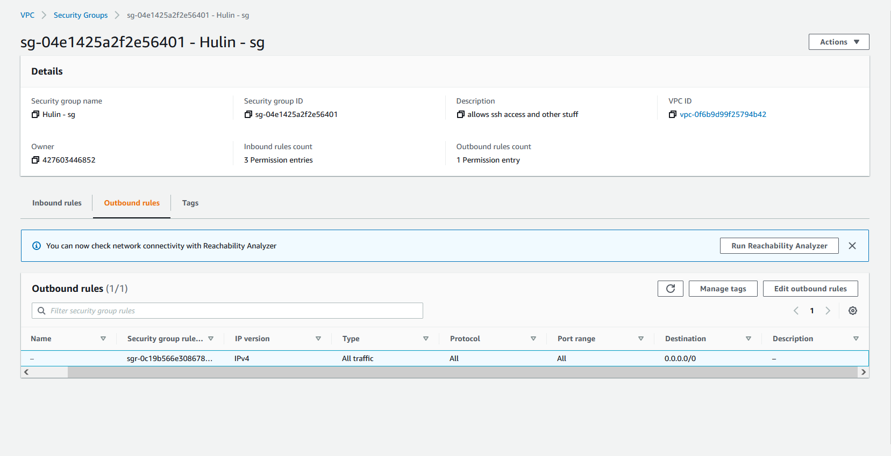

## Part 1 - Build a VPC

For each step below, provide a screenshot that shows the network resource has been created according to specification along with a description of what the resource does (what is its role). You may add whatever additional notes you would like. **The screenshot and description of each network component is required**. Any other notes you leave behind may make this project more useful in the future. Getting a good screenshot can be done by clicking on the resource and showing configurations in the details menu.

1. Create a VPC.
   - A VPC is a logically isolated virtual network that is dedicated to my AWS account. You can use your VPC to launch resources such as Amazon EC2 instances. 

 
 
2. Create a subnet
   
   - A subnet is the range of IP addresses in my VPC. You can use a public subnet for resources that must connect to the internet, and a private subnet for resources that are going to stay in your VPC. 

   
 
 
3. Create an internet gateway
    
   - A internet gateway is a VPC component that allows communication between a VPC and the internet, other VPCs, or an on-premises network. A gateway provides this service by acting as a target for your VPC route table. It supports IPv4 and IPv6 traffic. 

   
 
 
4. Create a route table
  
   - This component contains a set of rules, called routes, that determine where network traffic from your subnet or gateway is directed. 
   
 
 
5. Create a security group

   - A security group controls the inbound and outbound traffic in your VPC. You can add rules that control traffic based on protocol and port numbers. There are seperate rules for inbound and outbound traffic. s

   
   

## Part 2 - EC2 instances

1. Create a new instance. Give a write up of the following information:
   - AMI selected
      - Ubuntu
   - Default username of the instance type selected
      - ubuntu 
   - Instance type selected
      - t2.micro
2. Attach the instance to your VPC. As discussed there are different pathways to doing this. Say how you did it.
   - I attached my VPC to my instance by changing the option in `Network setting > VPC` from the default one to the VPC I created. 
3. Determine whether a Public IPv4 address will be auto-assigned to the instance. Justify your choice to do so (or not do so)
   - I did not associate a Public IPv4 for my instance. I did this because it would be redundant. It would be redundant because this project requires us to create a Elastic IP and attach it to the instance. 
4. Attach a volume to your instance. As discussed there are different pathways to doing this. Say how you did it.
   - I attached a volume to my instance in the `Configure storage` area of the `Launch an instance` screen. I chose the default option of 1x 8 Gigabyte gp2 root volume. 
5. Tag your instance with a "Name" of "YOURLASTNAME-instance". Say how you did it.
   - I chose the tag for my instance in the `Name and tag` area of the `Launch an instance` screen.  
6. Associate your security group, "YOURLASTNAME-sg" to your instance. Say how you did it.
   - I chose for the new instance to use my security group by navigationg to the `Network setting > Firewalls(security group)` area of the `Launch an instance` screen. I changed to my security group from the default option by choosing the `Select an existing security group` and selecting my security group from the drop down list. 
7. Reserve an Elastic IP address. Tag it with "YOURLASTNAME-EIP". Associate the Elastic IP with your instance. Say how you did it.
   - I created my Elastic IP address by first navigating to `Network and Securtiy > Elastic IPs` . 
   - I then clicked `Allocate Elastic IP address`. I used all of the default options and clicked `Allocate` at the bottom of the page
   - After the Elastic IP was created, I clicked `Actions > Associate Elastic IP address`. 
   - On the `Associate ELastic IP address` page, I chose my new instance from the drop down menu in the `Instance` field and selected the default private IP in the `Private IP adress` field. I then clicked `Associate` at the bottom of the page.

8. Create a screenshot your instance details and add it to your project write up.
   
9. `ssh` in to your instance. Change the hostname to "YOURLASTNAME-AMI" where AMI is some version of the AMI you chose. Say how you did it.
   - After getting into my system, I used the command `sudo hostnamectl set-hostname Hulin-ubuntu` to change my hostname
   - I then restarted my system
10. Create a screenshot your ssh connection to your instance and add it to your project write up - make sure it shows your new hostname.
   

## Resource I used

- [Amazon VPC Docs](https://docs.aws.amazon.com/vpc/latest/userguide/how-it-works.html)
- [Guide to Change Hostname](https://www.tecmint.com/set-hostname-permanently-in-linux)