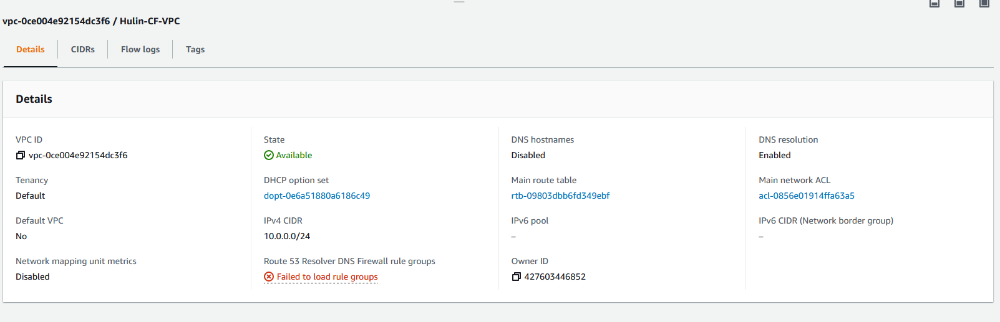
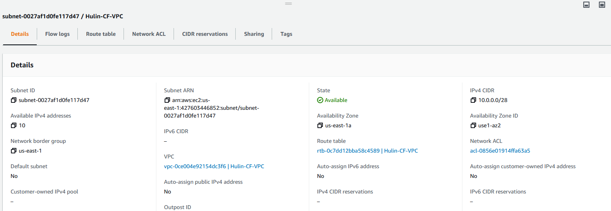
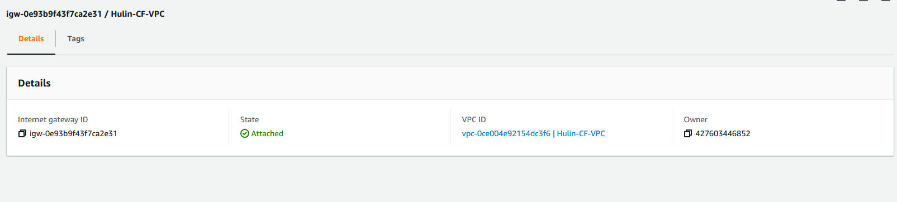
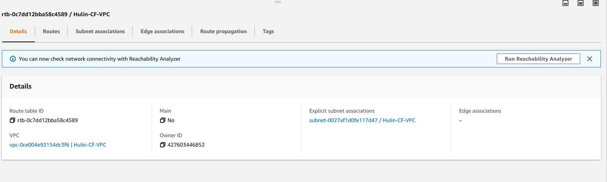
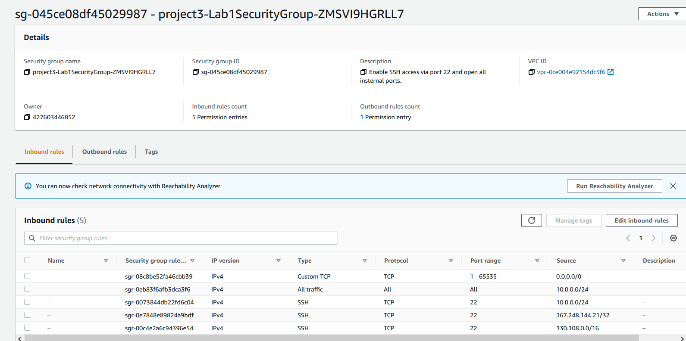
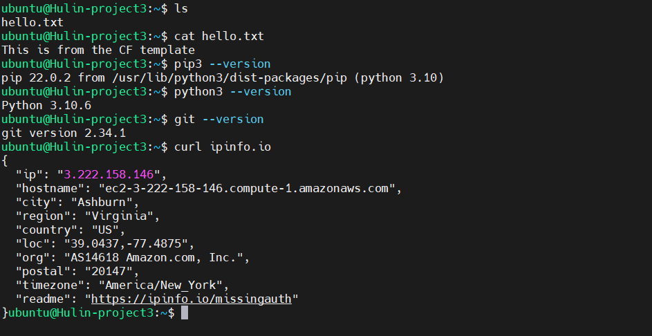

# Project 3

## Objectives:

- Create a CloudFormation to specification to remove manual creation
- Understand the role of Infrastructure as Code (IaC)

## Proof 

### Stack 

### VPC

### Subnet

### Gateway

### Route Tables

### Security Groups

### End Product 

## Resources Used

[Main Resource](https://docs.aws.amazon.com/AWSCloudFormation/latest/UserGuide/Welcome.html)