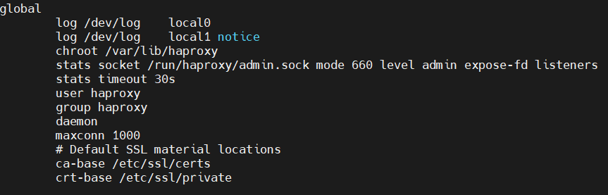
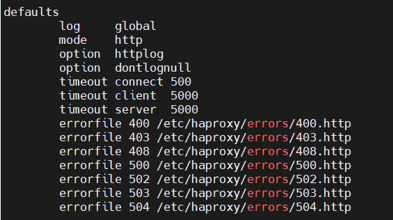
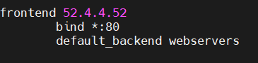
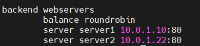
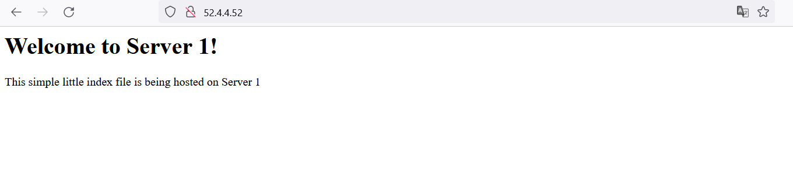
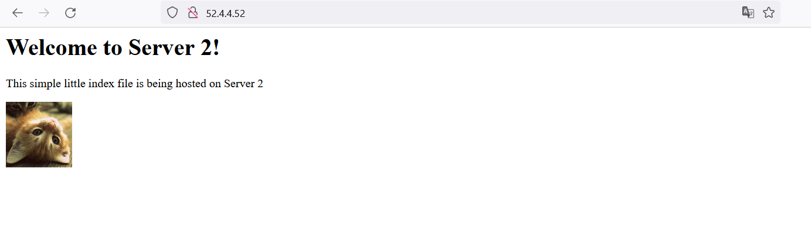

## Project 4 Documentation

1. Create an `/etc/hosts` OR `.ssh/config` file on each system that correlates hostnames to private IPs of systems within the subnet (your instances).
   - Description of how file is configured
      - I decided to edit the `/etc/hosts` file. The host file is used to map domain names to IP addresses. The format to do this is as follows: `IPAddress DomainName [DomainAliases]`. Here is an example of how I edited the hosts file on my proxy instance. 

    

    - Resources Used
        - [How to Edit Host File](https://linuxize.com/post/how-to-edit-your-hosts-file/)

2. Document how to SSH in between the systems utilizing their private IPs.
    - There are two ways you can ssh in between your VMs using the private IPs depending if you added a hostname to the hosts file. If you did not add a hostname to the hosts file you can use `ssh -i nameofkey.pem ubuntu@privateIPaddress` to ssh to the instance. If you did add a hostname to the hosts file you can use `ssh -i nameofkey.pem hostname` to ssh to the instance. 

3. **_HAProxy configuration & documentation requirements_**
   - How to set up a HAProxy load balancer
     - What file(s) where modified & their location
         - I modified the haproxy.cfg file. The path to the file is `/etc/haproxy/haproxy.cfg`. 
     - What configuration(s) were set (if any)
         - The haproxy.cfg file contains four sections where I made configurations. These sections are global, defaults, frontend, and backend. 

         - In the global section the only configuration I made was that I set the maximum amount of connections to my proxy to 1000.

         

         - In the default sections I orignally changed the timeout settings. I ended up restoring the timeout settings to the defaults during troubleshooting and didn't bother to changing them again.

         

         - I had to create the frontend section because the default haproxy.cfg does not contain it. I set my front end keyword to my proxy's public IP address. I assigned a listener to port 80 by using the `bind` setting. I then specified what my default backend where with the `default_backend` setting. 

         

         - I had to create the backend section because the default haproxy.cfg does not contain it. I set my back end keyword to the `default_backend` variable I defined the frontend section. I then set how haproxy will chose which server to forward traffic to with the `balance` setting. I then used the `server` setting to define which servers my traffic will be forwarded to. 

          
     - How to restart the service after a configuration change
         - `sudo systemctl restart haproxy`
     - Resources used (websites)
        - [Main Resource Used for Haproxy](https://www.haproxy.com/blog/the-four-essential-sections-of-an-haproxy-configuration/)
        - [Haproxy Troubleshooting Resource](https://bobcares.com/blog/haproxy-network-error-cannot-bind-socket/)
4. **_Webserver 1 & 2 configuration & documentation requirements_**
   - How set up a webserver
     - What file(s) were modified & their location
         - The only files that were modified were at `/var/www/html`. I renamed the default index.html file and then created a new index file based on the template that was given by the instructor. 
     - What configuration(s) were set (if any)
         - I did not change any configurations in the apache configuration file because there was no need to. 
     - Where site content files were located (and why)
         - The site contents are hosted at `/var/www/html`. They are hosted here because this is the default location in the apache config file. 
     - How to restart the service after a configuration change
         - `sudo systemctl restart apache2`
     - Resources used (websites)
         - [Main Resource Used for Apache](https://www.digitalocean.com/community/tutorials/how-to-install-the-apache-web-server-on-ubuntu-20-04)
5. From the browser, when connecting to the proxy server, take two screenshots.
   - one screenshot that shows content from "server 1"
   
   - one screenshot that shows content from "server 2"
   
   - [Link to Proxy](http://52.4.4.52)`