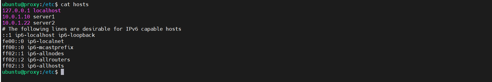

## Project 4 Documentation

1. Create an `/etc/hosts` OR `.ssh/config` file on each system that correlates hostnames to private IPs of systems within the subnet (your instances).
   - Description of how file is configured
    - I decided to edit the `/etc/hosts` file. The host file is used to map domain names to IP addresses. The format to do this is as follows: `IPAddress DomainName [DomainAliases]`. Here is an example of how I edited the hosts file on my proxy instance. 

    

    - Resources Used
        - [How to Edit Host File](https://linuxize.com/post/how-to-edit-your-hosts-file/)

2. Document how to SSH in between the systems utilizing their private IPs.
    - There are two ways you can ssh in between your VMs using the private IPs depending if you added a hostname to the hosts file. If you did not add a hostname to the hosts file you can use `ssh -i nameofkey.pem ubuntu@privateIPaddress` to ssh to the instance. If you did add a hostname to the hosts file you can use `ssh -i nameofkey.pem hostname` to ssh to the instance. 

3. **_HAProxy configuration & documentation requirements_**
   - How to set up a HAProxy load balancer
     - What file(s) where modified & their location
     - What configuration(s) were set (if any)
     - How to restart the service after a configuration change
        `sudo systemctl restart haproxy`
     - Resources used (websites)
        -[Main Resource Used](https://www.haproxy.com/blog/the-four-essential-sections-of-an-haproxy-configuration/)
        -[Haproxy Troubleshooting Resource](https://bobcares.com/blog/haproxy-network-error-cannot-bind-socket/)
4. **_Webserver 1 & 2 configuration & documentation requirements_**
   - How set up a webserver
     - What file(s) were modified & their location
     - What configuration(s) were set (if any)
     - Where site content files were located (and why)
     - How to restart the service after a configuration change
        `sudo systemctl restart apache2`
     - Resources used (websites)
5. From the browser, when connecting to the proxy server, take two screenshots.
   - one screenshot that shows content from "server 1"
   - one screenshot that shows content from "server 2"
6. (Optional) - link to your proxy so I can click it.